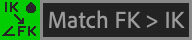

# Forward Kinematics

Forward Kinematics, or FK, allow you to animate by specifying rotation values for the upper and lower part of the limb, instead of positioning the end controller and letting the computer figure them out (that’s what IK is). FK is useful in a number of different circumstances, for example:

* Swinging arms that follow the movement of the body
* Animating between a clockwise and anti-clockwise pose with very smooth arcs
* Animating an arm that moves across the chest
* Leg movements that flow outwards from the hip such as kicking, swinging or [swimming](https://www.instagram.com/p/BP5RCZ7ABUO/)
* ‘[Breaking the joint](https://babbittblog.com/2014/02/06/how-babbitt-changed-animation-methodology-pt-2-of-4/)’ to let elbows bend backwards slightly

The FK property is a percentage slider that goes from 0 (full IK) to 100 (full FK). You should animate on 100% IK or 100% FK, and keyframe the FK property between them when you need to change. This is called blending.  On IK, you animate the position of the end controller. On FK, you animate the Upper and Lower FK Rotation values.



###  FK and IK Matching

When you blend from IK to FK, you rarely want the FK Rotations at their default values, which would make the limb point straight down. By clicking the **Match FK > IK** button, Limber will work out what the FK Rotation properties need to be in order to match your current IK pose, and set their values accordingly. Similarly, if you are animating in FK, you can click **Match IK > FK** and Limber will set your end controller’s position property to match your current FK pose. Matching IK to FK can also alter the Clockwise property, since FK Rotations can be either clockwise or anti-clockwise.


If you are animating on IK but _not_ keyframing the Position property of the end controller (eg. if you're animating the position of a foot layer with the end controller parented to the foot, rather than the other way around), matching IK to FK probably won't work as expected.


If the Clockwise property is not fully 100% or -100%, and/or you’re using Anti-pop above zero, the matching isn’t perfect.
