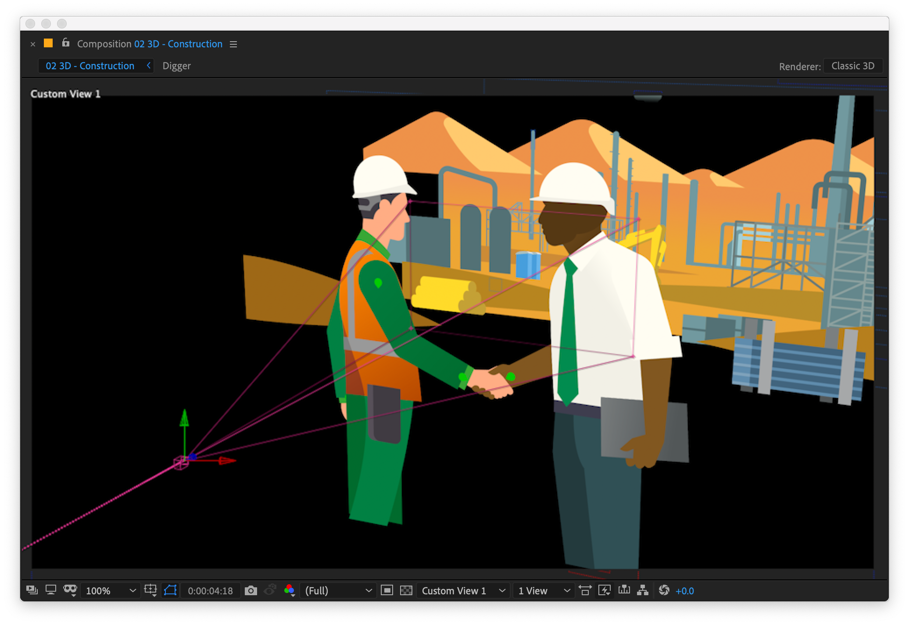

# Scaling and 3D Space

### Scaling in 2D&#x20;

Limb layers have expressions on them to prevent them from being transformed, because it would alter the internal, co-ordinate space of the layer and mess everything up.  So you can't simply alter the Scale of a limb layer to make it bigger.  But if you want to scale a character as a whole, you can do so using the Size Scale property and a ‘master layer’ for you character.

The first video in the Limber training series has a section all about 2D scaling, [right here](https://youtu.be/HV9nxTowr0o?list=PLZAr8tT8TcsRvK0jYz4U4Lg4OPA2NHAv6\&t=1462).

A master layer is a layer, typically a null, that every layer in your rig is ultimately parented to in one way or another. This layer’s Scale property should match the Limber effect’s Size Scale property when your character is at it's 'normal' size (the simplest thing is to have them both at 100%).  Make a new expression on the Size Scale property, and pickwhip it's value to the X or the Y Scale value of your master layer.  Make sure **Link Length to Size Scale** is checked on. You can then alter the scale of the master layer, and the limbs will scale up with the rest of your character.

### Scaling gotchas

If you’re using FK Controllers in your character, then you’ll probably need them to scale with the Size Scale property, so that the hands or feet layers that are parented to them also scale.  You can do that by pickwhipping the FK Controller’s Scale property to the master layer’s Scale property, in the same manner as above.

A default bone’s Stroke Width property won’t scale up automatically like tapers do.  If you need bones to scale, that's also covered in [the training video, here](https://youtu.be/HV9nxTowr0o?list=PLZAr8tT8TcsRvK0jYz4U4Lg4OPA2NHAv6\&t=1640). Alternatively, consider using a customized bone from the [limb library](../custom-limbs/the-limb-library.md) - some of which scale automatically with the Size Scale property.

### Using Limber in 3D space

You _can_ use Limber natively in 3D space without pre-composing, but it is not something we recommend.  If you do, there are some best practices to know about:

The recommended method is to use a master controller as mentioned above.  Make sure all of the layers in your rig are ultimately parented to the master controller.  But, for use in 3D you should **also parent the limb layer to the master controller**.  Enable the 3D switch for every layer in your character, including the limb layer(s), controllers and master controller.  If you want to move your character in the Z plane, alter the Z Position value of the master controller **only** (we recommend separating dimensions on the master layer to make this easier). If everything is parented correctly, the entire character will move in Z space and still function normally.

If you add a new FK or Joint Controller to a 3D limb set, the new layer will be 2D, and it will need to have it’s 3D switch enabled.  Because these types of controllers have their Position controlled by expressions, the best option here is to parent them to their relative limb layer. Once you’ve done both those things, they should snap into the correct position in space. 
