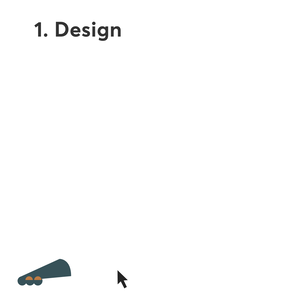
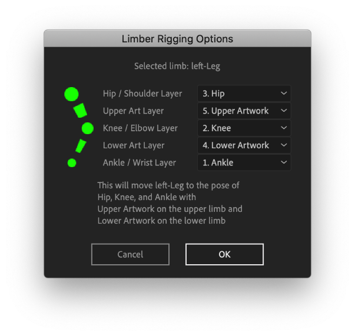

# Rigging and posing limbs

This is a long page but stick with us: Rig & Pose is one of Limber's most powerful and popular features.

### &#x20;

If your limbs need additional or alternative shapes in them, the **Rig & Pose** button can copy artwork into a limb so that it will 'stick' as the limb moves and stretches. We call this **rigging** artwork.

The Rig & Pose button also has a second function - to set limb properties based on three circle layers. We call this **posing** a limb.

You can use each function independently, or at the same time in a single operation - which is a very efficient workflow in the character design-rig-animate pipeline.

Only vector artwork can be rigged.  We recommend designing limbs in Adobe Illustrator, and then either importing them into After Effects and using the _Layer>Create>Create Shapes from Vector Layer_ command, or using a third party import tool such as [Overlord](https://www.battleaxe.co/overlord).  For modifying artwork once it has been rigged, we recommend [Penpal](https://aescripts.com/penpal/).

To **pose** the [sizes, colours and lengths](../getting-started/limb-properties.md) of the limb as well as the position of the controllers, you'll need to select three, separate layers - typically each with an Ellipse shape and single color.  Limber will use the size, color and position of these layers as a reference to set the relevant properties in the [Limber effect](../getting-started/limb-properties.md) - Start, Middle and End Size, colors, and lengths.


When you pose limbs using circle layers, Limber assumes those layers have their anchor points at their center. If they don't, things will get offset in weird ways.


To **rig** artwork to a limb, you will need to select one or two shape layers that contain your artwork.  Each of these layers will be transferred to either the Upper or Lower part of the limb.  You will also need to _either_ pose a new limb to reference layers (as described above) _or_ select an existing limb - otherwise Limber would not know where to place your artwork!


These functions work with all default limbs, but **not** all of the limbs in the limb library. Generally, those that contain a _Limb_ group, with an _Upper Group_ and a _Lower Group_ inside, can be rigged.


If you are posing the limb at the same time as rigging, your artwork should obviously be positioned between your ellipse reference layers.  If you are posing using an existing limb, your artwork should be placed in a way that makes sense to the eye, relative to that limb.

Ideally, select your layers in the following order:

* **Hip / Shoulder** reference layer
* **Knee / Elbow** reference layer
* **Ankle / Wrist** reference layer
* **Thigh / Bicep** Upper Art layer
* **Calf / Forearm** Lower Art layer

If you also select an existing limber layer (either before or after the other layers), Limber will intelligently apply the functions to that limb.  If you don't select any limber layers, it will generate a new limb, based on the pose reference layers, and apply the functions to this new limb.  If you are only posing, or only rigging artwork, you should still select layers in this order - just miss out the ones you don't need.

The Rig & Pose Options panel gives you a chance to check how your selected layers will be used, and change them if necessary:

If you named your layers appropriately, you can quickly see if they've been assigned correctly. Re-assign them in the dropdowns if necessary, check that the correct limb is being used (if any), click OK and let the magic happen ✨.

Limber adds new groups to your limb layer and copies your art in to them.  These groups will scale correctly when you use controls that change the limb's length, eg: Anti-pop, Clockwise and so on.  **They also scale when you alter the Upper and Lower Length properties**, so it's best to make sure your limbs are at a normal, correct length when you rig artwork. If you subsequently change their length, that artwork will get stretched or compressed.


Make sure the Size Scale property is at it's default value of 100% when you rig artwork. If it's not, the art will be distorted.




You can add further artwork to a limb that has already been rigged as above. Simply follow the same process again - select one or two art layers and your limb layer and click Rig & Pose. Limber will add new shape groups on top of the existing ones inside the limb.
