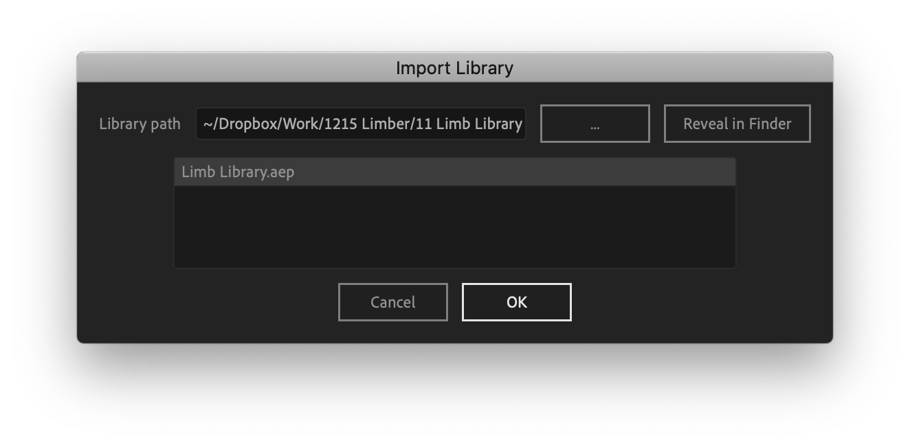

# The Limb Library

Default limbs are really just one of many ways we can rig shape layers to our IK-FK geometry. By using Limber's [Copy and Paste](../managing-limbs/copying-and-pasting-limbs.md#copying-and-pasting) functions with the Limb Library, you can access many other styles that the default limbs can't achieve, even with art-rigging.

The limb library is a standard .aep project file and it's included in the .zip file you download when you purchase Limber. It's organized into separate comps, one for each limb, with a text layer that explains how they work.


Not all limb library limbs are fully compatible with [Bodymovin](https://github.com/airbnb/lottie-web) or the [Rig & Pose](rigging-limbs-with-artwork.md) functions. We suggest you run a test if you need either of these.


Some of the limbs in the limb library have user-controlled properties which are not in the Limber effect.  These properties are provided via Effects **on the limb layer.** Similarly, some limb library limbs do not respond to every property in the Limber effect (just like default Bones do not respond to Color properties, for example). Where things are not obvious, the text layer should explain.

Once you've imported the library into your project, you can copy and paste a limb into your character's existing limbs. Remember you can **Alt-paste** to preserve the Length, Size, Color and other options you have already set in the [Limber effect](../getting-started/limb-properties.md) of your destination limb.

### Importing the limb library

### &#x20;

The **Import Library** button remembers the directory path of your limb library, separately to After Effects' standard Import dialog; and so it saves you from having to navigate to the limb library every time you want to import.  The Import Library dialog provides you with buttons to change the stored directory, reveal the location in your OS, and select from several library files if you have them.

You don't have to use _only_ the limb library file we provide - you could also create your own library file with limbs you've customized yourself on previous projects.  How you organise the files is up to you, but we recommend that you keep your limb library in a folder where you'll always be able to access it.
