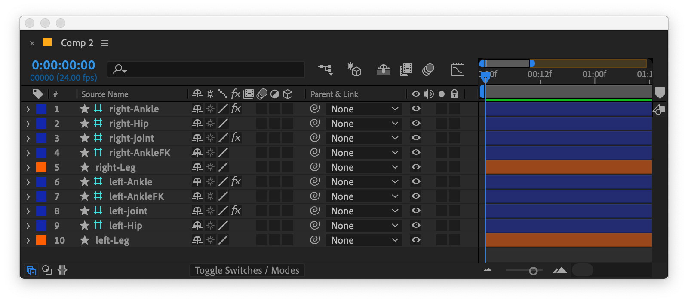

# Controllers and limb layers

For each new limb, Limber generates three layers, which we call a **set** of layers: The **limb layer** itself, and two **controllers** that correspond to the position of the **start** (shoulder or hip) of the limb, and the **end** (wrist or ankle). The controllers are [guide layers](https://www.google.com/url?sa=t\&rct=j\&q=\&esrc=s\&source=web\&cd=\&cad=rja\&uact=8\&ved=2ahUKEwj7_tvI0_LpAhUSURUIHQi7ArQQygQwFHoECAQQBw\&url=https%3A%2F%2Fhelpx.adobe.com%2Fuk%2Fafter-effects%2Fusing%2Flayer-properties.html%23guide_layers\&usg=AOvVaw3zxXbyt2O9f46f1qSrA-JD) so that they don't appear in your final render. For simple IK animation, you’d parent the **start controller** to one of your character's body layers, and keyframe the **end controller**'s Position property to animate that limb.

By default, controllers are shaped like a teardrop 💧 so that they are easy to grab in After Effects' composition panel, whilst displaying direction -the pointed end of the controller aims towards where it is rotated. You can choose a different controller shape from the settings panel if you prefer.


Many of the operations in Limber require you to select a limb. Most of the time, it doesn't matter which of the limb's layers you have selected. You can select the limb layer or any of the controllers.


There is an [effect](https://helpx.adobe.com/uk/after-effects/user-guide.html?topic=/uk/en/after-effects/morehelp/effects.ug.js) called _Limber_ on every limb's end controller that gives you [properties](limb-properties.md) to determine the appearance and behavior of that limb.  Some of those properties control aspects of the underlying, dynamic skeleton.  Some of them control elements of the style of the limb layer.

You can use buttons in the [Limber panel](../the-limber-panel.md) to add two other types of controller to a limb set - [FK Controllers](../animating-with-limber/adding-controllers.md#fk-controllers) and [Joint Controllers](../animating-with-limber/adding-controllers.md#joint-controllers).  These types of controller should not be parented to other layers or have their Position animated by the user.  Instead, they provide a layer in the timeline to which you can parent other layers, such as hands or feet, or… kneepads.
