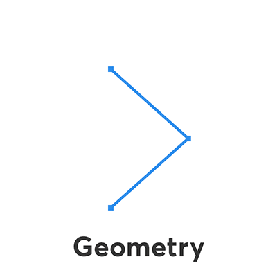

# Limb anatomy

It can be helpful to think of Limber's limbs as having two aspects:

* The underlying skeleton or geometry that provides animation features like separate lengths and FK blending.
* The way that we set up the limb layers on top of that geometry, with colors and shapes.

The limb layer is kind of like putting flesh and clothing on an invisible skeleton.  There are an infinite number of ways we could do that, so we settled on a few options that work for a wide range of situations. These are the types of limb that Limber stores in it's own code, and can generate when you click the **New** button, and we call them **default limbs**.

**Bones** are a super-simple path with a stroke applied and so they preview and render very fast. Bones can be altered by adjusting Stroke properties in the limb layer, just like any other shape layer.

**Taper** limbs are based around three connected circles that you can change the sizes of. The middle circle is where the elbow or knee bends; so the joint always looks good, whatever angle you make it. Tapers can be split into different colors at two points along the length of the limb, and those splits also respond to [rounding controls](limb-properties.md#rounding) so that they can have a sense of volume and [faux-3D](https://www.behance.net/gallery/69741957/AE-Tutorial-Fake-3D) perspective.

**Legacy Tapers** look identical to Tapers but are constructed a little differently - the way we used to do it before v1.6. They are included to support some older rigging methods that some people still use.

**Three Circle** limbs are designed specifically for [rigging your own artwork](../custom-limbs/rigging-limbs-with-artwork.md). In many cases, when you use your own artwork you don't need a full-blown Taper limb underneath, but using Three Circles will give you that perfect rotation around the joints.
