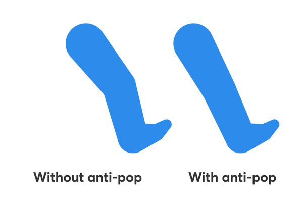
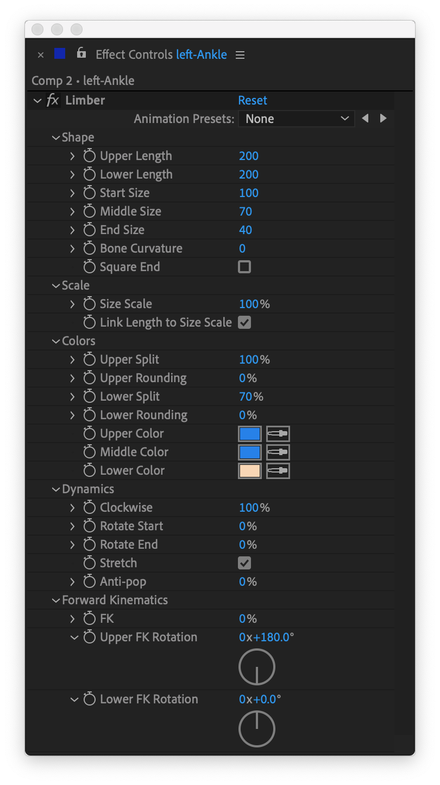

# Limb properties

Remember how we said that limbs have an [underlying geometry](how-limber-works.md)? Some of the properties we provide for limbs affect that geometry (Lengths, or FK, for example) whilst some of them affect the appearance or style of the limb (colors, for example). But because there are several types of default limb (and infinite types of custom limb) **not all the properties affect all types of limb**. This can be counter-intuitive for beginners but it's our way of giving you the best of both worlds: you can get an automated, color-controlled, general-purpose Taper limb with just a couple of clicks, **and** you can go on to use [more dynamic limbs](../custom-limbs/the-limb-library.md) and rigging techniques that open up new possibilities.

If you're not a fan of expressions and automation, you could side-step that more procedural route, and concentrate on [rigging your own artwork](../custom-limbs/rigging-limbs-with-artwork.md) into limbs, and still expand the range of styles you can work with.

But let's get back to basics: to change the look and behavior of a [default limb](basic-and-custom-limbs.md), select the end controller and twirl down the Limber effect's property groups:

### **Shape**

The lengths of the limb determine how long it is, in pixels. From the center point of the hip to the center point of the knee is the **Upper Length** and similarly, from the knee to the ankle is the **Lower Length**.

The **Start Size**, **Middle Size** and **End Size** determine the diameter of the three circles of Taper and Three Circles limbs, in pixels. Default bones do not respond to this property.

**Bone Curvature** applies a smooth curve to the joint of the bone. Default tapers do not respond to this property.


Bone curvature has no effect on default tapers, but it will affect the rotation of controllers, so if you are not actually using a limb with curvature, make sure you keep it set to zero.&#x20;


The **Square End** property cuts the end circle off, so you have the appearance of a squared-off end to the limb. Default bones do not respond to this property.

### **Scale**

The **Size Scale** property will scale all the three circle sizes at once. If you have **Link Length to Size Scale** checked, the length of the limb will scale up proportionally, too. This enables you to [scale a limb](../animating-with-limber/scaling-and-3d-space.md#scaling) along with the rest of a character.

### Colors

The **Upper Split** and **Lower Split** properties determine where the upper and lower parts of a Taper limb are split, by a straight line, into different colors. The upper part uses the **Upper Color** and **Middle Color**, while the lower part uses the **Middle Color** and the **Lower Color.** The splits are a percentage of the length of each part, calculated from the centers of the controllers.

Default bones do not respond to these properties, but check out the _Colored Bone_ in the [limb library](../custom-limbs/the-limb-library.md) if you want a bone that does.

There are also **Upper Rounding** and **Lower Rounding** properties which will curve the straight line of the split into faux-3D perspective.

### Dynamics

The **Clockwise** property will determine whether the limb's joint bends out to the left or to the right. Usually you’d set this to either 100% or -100% and then leave it, but it can be keyframed between these values for certain inbetweens.  At 0% the limb will always appear perfectly straight regardless of where the controllers are, as if the joint was pointing directly towards or away from the viewer rather than out to one side.


When you copy and paste from one limb to another, the Clockwise property values are not pasted (because you often want to paste a left-facing limb onto a right-facing one.)


The **Rotate Start** and **Rotate End** properties will enable the respective controllers to [automatically rotate](../animating-with-limber/controllers.md#controller-rotation) along with the limb, when they’re at 100%.   At 0% the controllers will not rotate as they move around. You can keyframe between these values to make transitions between poses or cycles of animation easier.

The **Stretch** property enables your limb to stretch beyond it's nominal length. If unchecked, the limb will not extend to an end controller that is further away from a position where the limb is dead straight.


If you have a foot layer parented to the end controller, and you want limited-length legs, you can use an [FK controller](../animating-with-limber/adding-controllers.md#fk-controllers) to get the foot to ‘stick’ to the non-stretchy leg.


**Anti-pop** helps prevent the visual pops or jerking that can occur in IK animation, such as when limbs become straight too suddenly. It works by making the limb shorter as it approaches a 90º angle at the joint, and the normal length when dead straight or fully folded.  Values above 50% tend to work best with Anti-pop.  Anti-pop sometimes produces [undesirable effects](../faq.md#why-do-things-go-weird-when-i-use-blending) when you blend betwen IK and FK.&#x20;

### Forward Kinematics

Most of the time, you'll want to animate with IK. But [some situations work better with **FK**](../animating-with-limber/forward-kinematics.md), and you may find it easier to blend from one to the other than having to use a checkbox switch. This is when you would typically keyframe the FK property from 0 to 100.

You can then use **Upper FK Rotation** and **Lower FK Rotation** to control the angles of your limb, almost as if it were a pair of ordinary, parented layers. If you have a hand or foot layer parented to the end controller, you'll need to [add an FK Controller](../animating-with-limber/adding-controllers.md#fk-controllers), first.

