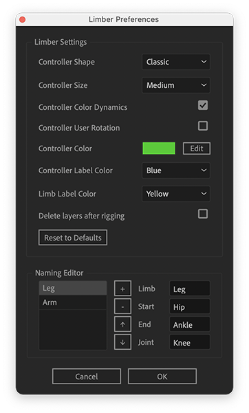

# Settings Panel

Limber's settings panel is accessed by clicking on the gear icon button in the top left. It's used for setting things like the shape and size of controllers and the way layers are named.

### **Limber settings**

These options let you control how newly generated controllers look and behave. You can choose an alternative **Shape** for your controllers:

**Controller Size** and **Color Dynamics** [can always be altered whilst you are working with a limb](../animating-with-limber/controllers.md) but here you can set the state for new ones. If you enable the **Controller User Rotation** checkbox, you will be able to manually modify the Rotation property of your controllers.

**Controller Color** is the color they appear in the comp. **Controller Label Color** and **Limb Label Color** set the colors of the layers in the timeline.

Enabling **Delete layers after rigging** will make Limber automatically delete the shape layers that you rig into limbs using the Rig & Pose functions. We recommend leaving this setting unchecked and doing it manually but more experienced users may prefer to use this option.

### Naming Editor

The suffixes that Limber applies to your layer names - _Ankle_, _Hip_ and _Leg_ in the image above, are stored as presets. To add a new preset, click on the **+** button. To remove a preset, select one and click on the **-** button. To edit a preset, select it from the list and then click and edit the textfields on the right.  You can change the display order of presets by clicking the **up** or **down** buttons. Presets are saved locally when you hit OK.

