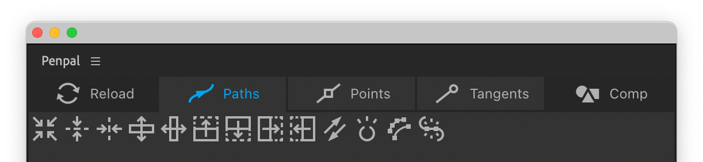

# Paths tab

The functions in the Paths tab tend to affect the shape as a whole, rather than it’s individual points.


When we refer to a path’s **bounding box** we mean the rectangle formed by it’s outermost visible parts.


####  Center

Center the path in the composition, layer or shape group, depending on which Space you have active.&#x20;

####  Center vertically,   Center horizontally

Vertically or horizontally center the path, as above.

####  Flip vertically,  Flip horizontally

Flip the path top-to-bottom or left-to-right, around its  center.

####  Flip up,  Flip down,   Flip right,   Flip left

Flip the path around the top, bottom, right or left edge of its  bounding box.

####  Reverse

Reverse the order of the points in the selected path. It’s first vertex will remain the same, unless you apply it to an open path, in which case the first vertex will be moved to the opposite end.

####  Toggle open

Toggle selected paths from open to closed, or vice versa. If you have multiple paths selected, you can hold `Alt` to make them all open, or `Cmd/Ctrl` to make them all closed.

####  Simplify

This function removes points from the selected paths whilst attempting to preserve their basic shape. When you hover over the button, it brings up a slider below. Drag the slider to the right to reduce the number of points and Penpal will preview how your paths will be simplified. To apply it, click the blue checkmark icon. If you move your cursor away from the slider container, the process is aborted.

####  Join

This button will join two or more open paths into one. Paths are joined in the order they were selected in the canvas, and from each one's last point to the next one's first point (following their direction). A new, joined path is created, and the original paths are turned off in the timeline. If your paths seem to join at the wrong ends you probably need to [reverse](path-tab.md#reverse) one or more of them before you join them.


The Join function currently does not support masks, it only works with shape paths.


