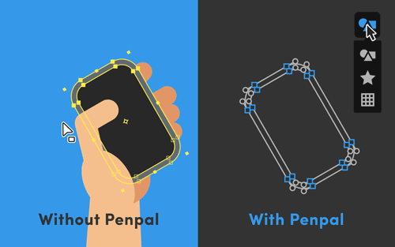
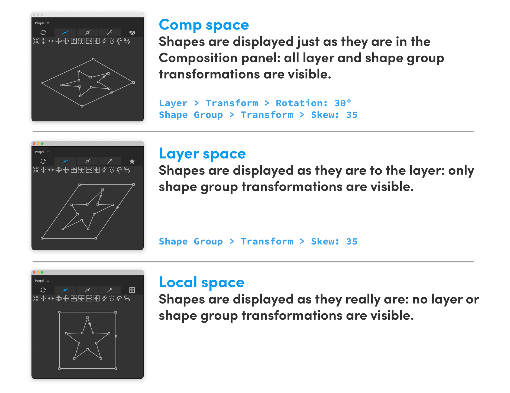
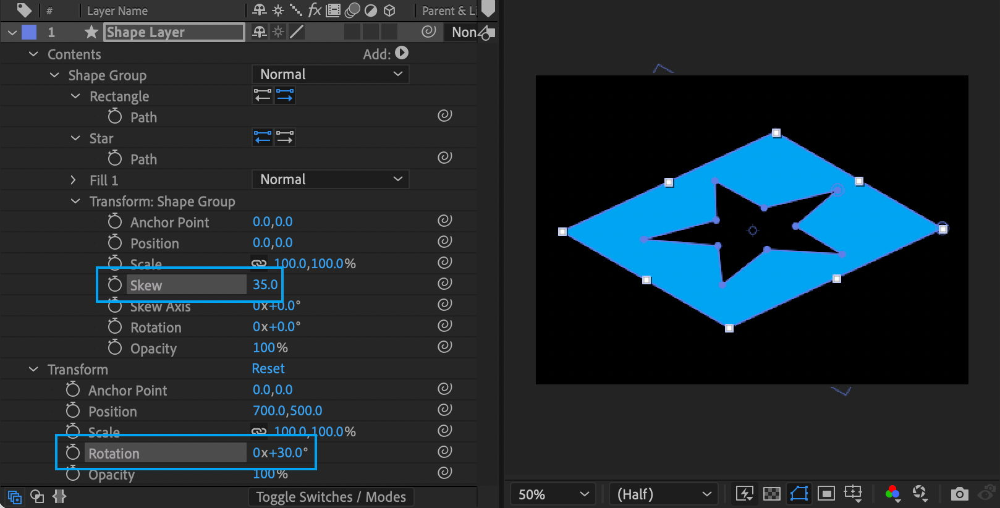

# Spaces

**Spaces** are ways of handling paths _**with or without transformations**_. Let's say you have a rounded, rectangular path, but it's layer has been rotated. If you want to make the shape taller, it's easier to do so without that rotation. Normally, you'd have to use a precomp to do this, and go into the un-rotated precomp. But Penpal can sort of _see inside_ layers, and show you the path as it is, without the rotation.

The **Spaces button** shows the active space. When you hover over it, a dropdown allows you to activate a different space.

 **Comp space** shows your paths as they appear in the composition panel in After Effects, with all the positioning, scaling, rotating, skewing, and other transformations that are affecting them.

 **Layer space** shows paths as if you were ‘inside’ the layer they are a part of. So if that layer is rotated, your paths will be shown without this rotation.

 **Local space** shows paths as they 'really are', without any of the transformations applied to both the layer **and** any shape groups they are in.

Many of Penpal's buttons behave differently depending on which Space you are in. If you [move points up](points-tab.md#move-up) in Comp space, they will move in the direction that is up in the composition. If your layer was rotated, and you moved them up _in Layer space_, they would move upwards _within the layer_, along it's angle of rotation.  [Flipping](path-tab.md#flip-vertically) and [centering](path-tab.md#center) Paths, [Aligning](points-tab.md#align-horizontal) and [distributing](points-tab.md#distribute-horizontally) points, [flattening](tangents-tab.md#flatten-vertically) and [flipping](tangents-tab.md#flip-horizontally) tangents, and even [snapping points to pixels](points-tab.md#snap)… all can behave differently if your path is inside a shape group or a layer that has been transformed. 
