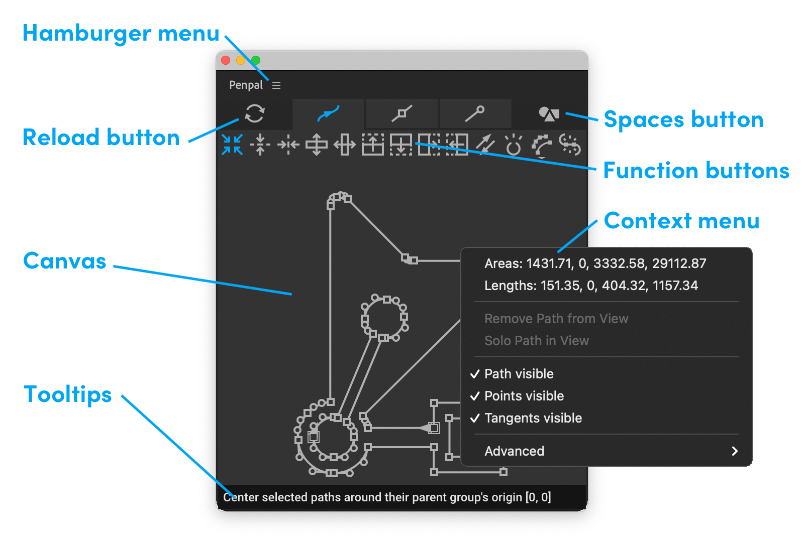

# The Panel

Let's look at the different parts of the Penpal panel:

**Hamburger menu** - this menu contains options for [licensing](master.md#licensing-and-trial-mode), updating and getting technical support for the product, as well as the [Preferences](preferences.md) and a link to this documentation.

 **Reload** button - reloads currently selected paths. This will de-select any [selected elements](elements-selections-and-tabs.md#selections) in the canvas.

**Tabs** - switches between groups of functions -  [Paths](path-tab.md),  [Points](points-tab.md) and  [Tangents](tangents-tab.md).

[**Spaces**](spaces.md) button - switches between  Comp,  Layer and  Local space.

**Function buttons** - to perform operations.

**Canvas** - the area where paths are displayed and you can [select elements](elements-selections-and-tabs.md). Paths are displayed as a line with an arrow after the first vertex, showing their direction. Points and tangents are represented by squares and circles.


If you **double-click** on a point or tangent in the canvas, a pop-up dialog will show you the exact co-ordinates for that element, and you can enter your own values to change it. These values are dependent on which [Space](spaces.md) you currently have active.

Note that if a tangent is zero'd it will be in exactly the same place as the point, so when you double-click on a point with a zero'd tangent, you will see and edit the values for either the point **or** the tangent depending on which tab is active: the point - in the points tab; or the tangent - in the tangents tab.


[**Context menu**](context-menu.md) - the context menu is shown when you right-click within the canvas.

**Tooltips** - displayed at the bottom of the canvas, describing the operation of whichever button your cursor is over. They can be disabled in the [Preferences](preferences.md).
