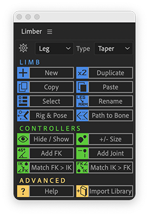
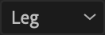
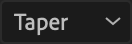
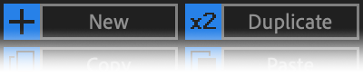

# The Limber Panel

Limber's panel can be docked to your After Effects' UI or used floating. Several buttons perform alternate operations when you hold **Alt** and click them.

 Settings button

 Name preset dropdown

 Limb type dropdown

 Function buttons
